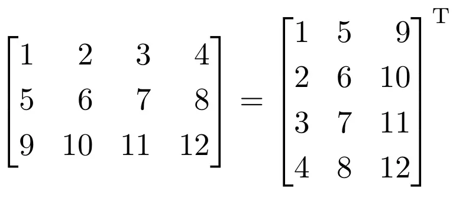

## **Преговор**

### **Задача 1**
Реализирайте функции, която по две цели числа връща по-малкото от тях като подавата числата по стойност, като указател и чрез референция (псевдоним). <br />
Използвайте ключова дума const и демонстрирайте чрез примери кога е възможна (и кога не) употребата на всяка една от функциите. <br />

### **Задача 2**
 Прочетете цяло число N от стандартния вход, последвано от N на брой цели числа. <br />
 Прочетете един символ от стандартния вход. Намерете броя на тези цели числа от въведените, които са по-големи от ASCII кода на символа. За целта използвайте динамична памет и функции. <br />

 ### **Задача 3**

> __Указания.__
> Да се използва динамично заделяне на памет. <br />

Да се напише програма, която прочита от конзолата матрица с размер `NxM` и я отпечатва трансонирана. <br />



Пищов: <br />

Операцията транспониране се нарича едно от следните действия: <br />
* Обръщането на A по главния ѝ диагонал;
* Записването на редовете на A като стълбове (колони) на A^T;
* Записването на стълбовете (колоните) на A като редове на A^T.

## **Структури**

### **Задача 4**
Създайте структура описваща студент.
Всеки студент се определя чрез:
- име (до 30 символа)
- факултетен номер(цяло неотрицателно число)           

За всеки от долупосочените примери демонстрирайте кои операции са възможни и кои не. <br />
Възможните операции са предефиниране на променливата и промяна на полетата. <br />

```c++
Student st = { "Kolio", 10 };
Student *pSt = &st;
const Student* pCSt = &st;
Student* const cPSt = &st;
const Student* const cpCSt = &st;
Student& refSt = st;
const Student& refCSt = st;
```

Създайте подходящо параметризирана функция initStudent(...); която въвежда коректни данни за студент. <br />                            
Да се напише функция, която принтира студент. <br />                           
Може да използвате помощни функции. <br />  

### **Задача 5**

Да се създаде структура която представя комплексно число. <br />    
Създайте функция, която събира две комплексни числа. <br />        
Създайте подходяща функция за извеждане принтиране на комплексни числа. <br />           
                                                        
### **Задача 6**

Да се напише програма, която да моделира точка (структура `Point`) в декартовата равнина.

Да се имплементира следната функционалност:
* `Point` да може да се прочита от стандартния вход.
* `Point` да може да се отпечатва на стандартния изход в подходящ формат.
* Да може да се намира разстоянието от центъра на равнината `(0.0, 0.0)` до дадена точка.
* Да може да се намира разстояние между две точки.

Бонус:
* По дадена точка, да се определи в кой квадрант е.
* По дадена окръжност с радиус r и център началото на координатната система, да се изведе дали точка K е в тази окръжност или по нейния контур.

### **Задача 7**

Реализирайте структура, описваща филм (`Movie`) със следните характеристики:
* Име на филм
* Продължителност в минути
* Жанр
  * Възможните стойности са описани с множеството 
  `{ Comedy, Action, Horror, Romantic }`
* Рейтинг

Създайте масив от филми и имплементирайте следната функционалност:

* Функция, която създава филм по подадени параметри.
> Spoiler: По принцип тази задача се делегира на конструкторите, които ще изучаваме скоро.
* Направете масив от филми и добавете 3 филма по ваш избор.
* Изведете всички филми в масива.
* Изведете топ филма в масива - този с най-много рейтинг.

Бонус:
* Сортиране на филмите по рейтинг.

### **Задача 8**

Една група се състои от краен брой студенти, като броят на студентите се задава от вас. <br />                       
Създайте структура, която описва група. Структурата също така трябва да пази средния успех на групата. <br />                     
* Направете функция, която създава група, вземайки информация от стандартния вход. Средния успех трябва да се сметне след въвеждане на информацията.                               
* Напишете функция, която приема група и минимален успех за стипендия, и връща колко студента ще получават стипендия.
* Създайте функция, която приема група и минимален успех за стипендия и извежда сортирани всички студенти, които ще получават стипендия идния семестър.        
