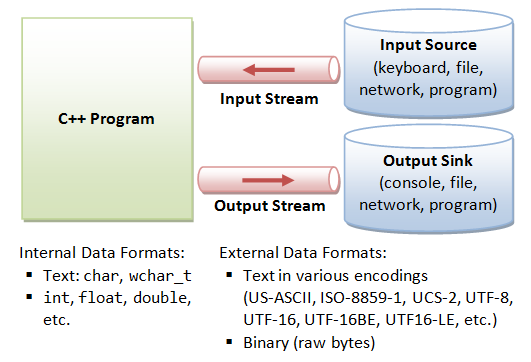
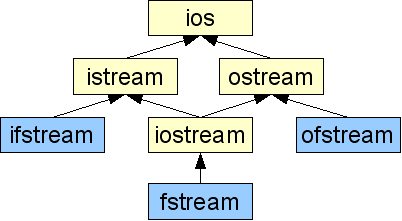

##  Потоци и Файлове (част 1). Текстови файлове.

### Видове потоци ###
Поток (stream) - последователност от байтове данни влизащи в и излизащи от програмата.
* При операциите за вход, байтовете идват от източник за вход (клавиатура, файл, мрежа или друга програма)
* При операциите за изход, байтовете данни излизат от програмата и се "вливат" във външно "устройство" (конзола, файл, мрежа или друга програма)
* Потоците служат като посредници между програмите и самите IO устройства по начин, който освобождава програмиста от боравене с тях.
* Потокът дефинира интерфейс с операции върху него, които не зависят от избора на IO устройство

    
  За да извърши вход или изход, една C++ програма:
  * Създава поток;
  * Свързва потока с IO устройството (напр. конзола, клавиатура, файл, мрежа или друга програма);
  * Извършва операции за вход/изход върху потока;
  * Прекъсва връзка с потока;
  * Освобождава потока;    
  
Видове потоци:
 - Потоци за вход ([istream](https://en.cppreference.com/w/cpp/io/basic_istream)).
 - Потоци за изход ([ostream](https://en.cppreference.com/w/cpp/io/basic_ostream)).
 


#####  Пример за работа с вход от конзолата. [cin](https://en.cppreference.com/w/cpp/io/cin) (обект от тип istream).
 ```c++
#include <iostream>

int main() {
	int a, b;
	std::cin >> a >> b; // read two integers from the console input stream
}
 ```
 Четем от стандартния вход.

#####  Пример за работа с поток за изход. [cout](https://en.cppreference.com/w/cpp/io/cout) (обект от тип ostream).
 ```c++
#include <iostream>

int main() {
	int a = 10;
	int b = 12;
	int c = a + b;

	std::cout << a << " + " << b << " = " << c << std::endl; // write two integers in the console output stream
}
 ```
	
### Работа с поток за вход от файл ([ifstream](https://en.cppreference.com/w/cpp/io/basic_ifstream))
Пример за четене от файл!
 ```c++
#include <iostream>
#include <fstream>

constexpr char FILE_NAME[] = "myFile.txt";

int main() {
	std::ifstream file(FILE_NAME); // create input file stream associated with myFile.txt

	if (!file.is_open()) {
		std::cout << "Error!" << std::endl;
		return -1;
	}
	
	int a, b;
	file >> a >> b;

	file.close();
}
```
Пример за прочитане на цялото съдържание файл:
 ```c++
#include <iostream>
#include <fstream>

constexpr int BUFF_SIZE = 1024;
constexpr char FILE_NAME[] = "myFile.txt";

int main() {
	std::ifstream file(FILE_NAME);

	if (!file.is_open()) {
		std::cout << "Error!" << std::endl;
		return -1;
	}
	
	while (!file.eof()) {
		char buff[BUFF_SIZE];
		file.getline(buff, BUFF_SIZE);
		
		//do something with the line
		std::cout << buff << std::endl;
	}
	
	file.close();
}
```
### Работа с поток за изход към файл ([ofstream](https://en.cppreference.com/w/cpp/io/basic_ofstream))
   
 ```c++
#include <iostream>
#include <fstream>

constexpr char FILE_NAME[] = "myFile.txt";

int main() {
	std::ofstream file(FILE_NAME);  // create output file stream associated with myFile.txt

	if (!file.is_open()) {
		std::cout << "Error!" << std::endl;
		return -1;
	}
	
	int a = 3;
	int b = 10;

	file << a << " " << b << " " << a + b << std::endl; // write into the output file stream
	
	if(!file.eof()) { //check if the file has ended
		std::cout << "The file contains more data after the two integers!" << std::endl;
	}

	file.close();
}
 ```

 - (istream) [get](https://en.cppreference.com/w/cpp/io/basic_istream/get) - функция, която чете следващия character в потока. 
 - (ostream) [put](https://en.cppreference.com/w/cpp/io/basic_ostream/put) - функция, която поставя на следваща позиция character в потока.
 - ifstream или istream - съдържа get указател, който реферира елемента, който ще се прочете при следващата входна операция.
 - ofstream или ostream - съдържа put указател, който реферира мястото, където ще се запише следващият елемент.
 - put и get не са [форматирани](https://www.geeksforgeeks.org/unformatted-input-output-operations-in-cpp/) за разлика от operator<< и operator>>, тоест не пропускат whitespaces и др.

