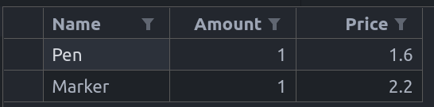

## Задача 1: Ю-Ги-О! 
Сето Кайба организира турнир по **Ю-Ги-О!**, но е съкратил бюджета в компютърния отдел и помолил нас да организираме базата данни с всички дуелисти в турнира.<br />
Трябва да реализирате 2 класа Ю-Ги-О! карти: <br />

**Карта чудовище**
- Име (низ с произволна дължина)
- Атакуващи точки (неотрицателно целочислено число)
- Защитни точки (неотрицателно целочислено число)

**Магическа карта**
- Име (низ с дължина до 25 символа).
-Ефект (низ с дължина до 100 символа).
- Тип (може да е един следните 3: “trap”, “buff”, “spell”)

Реализирайте клас **deck**.Тестето трябва да има:
- Масив от карти чудовища (максимално – 20 карти).
- Масив от магически карти (максимално – 20 карти).
- Метод, който връща като резултат броя на магическите карти в тестето.
- Метод, който връща като резултат броя на картите чудовища в тестето.
- Метод, който добавя магическа карта към тестето.
- Метод, който добавя карта чудовище към тестето.
- Метод, който променя магическа карта от тестето, като за параметри приема индекс и нова карта.
- Метод, който променя карта чудовище от тестето, като за параметри приема индекс и нова карта.
- Метод, който премахва магическата карта на определена позиция от тестето
- Метод, който премахва картата чудовище на определена позиция от тестето

Реализирайте клас **Duelist**. Той трябва трябва да има:
1. Име (Низ с произволна дължина).
2. Тесте(deck)
3. Дуелистът трябва да има същите методи като в deck, с които да променяме тестето 
му

## Примери
```c++
//40 cards = 20 MonsterCards/20 MagicCards
Deck d;

// 4-th card in the Monster deck becomes "Blue-eyes white dragon" with
//ATK: 3000 DEF: 2500
d.changeMonsterCard(4, "Blue-eyes white dragon", 3000, 2500);

// 5-th card in the Magic deck is added/changed to "Monster reborn"
d.changeMagicCard(5, "Monster reborn", “revive”, spell);

//Returns the amount of MagicCards in the deck
d.getMagicCardCount(); //1

//Returns the amount of MonsterCards in the deck
d.getMonsterCardCount(); //13

Duelist player1("Seto Kaiba");

///Changes the 2-nd monster card in the Monster deck to“Dark Magician”
MonsterCard DarkMagician("Dark Magician", 2500, 2100);
player1.changMonsterInDeck(2, DarkMagician);

Duelist player2("Yugi Muto");

//Changes the 2-nd magic card in the Magic deck to “Reflection”
MagicCard Reflection(Reflection", “Reflects the last played spell”, trap);
Player2.changeMagicCardInDeck(2, Reflection );
```

## Задача 2: Shopping-Cart


Да се имплементира количка за пазруване, която да съхранява определени предмети, запазени преди да се извърши покупка.

Използвайте изучените ООП  принципи до този момент, за да моделирате предмет и самата количка.

> Разделете декларациите и дефинициите в отделни файлове.

Всички предмети в магазина се моделират от клас / структура `Item`.

Един предмет трябва да съдържа следните полета:
- Име
- Наличност
- Цена

За член-данната `Име` използвайте тип `char*`.

> Помислете дали тук е нужна голямата тройка (четворка)?

Имплементирайте **мутатори** и **селектори**.

Създайте и клас / структура `ShoppingCart` за съхранение на предметите.

В `ShoppingCart` добавете следните методи:
- `addItem` - Добавя предмет към количката само ако вече не съществува друг такъв със същото име. Връща информация дали е бил добавен предмета.
- `removeItem` - Премахва предмет по подадено име, ако съществува. Връща информация дали е бил премахнат даден предмет.
- `itemsCount` - Връща колко на брой предмета има в количката.
- `exists` - По дадено име проверява дали предметът е в количката. 
- `isEmpty` - Дава информация дали количката е празна.
- `getPriceOf` - По подадено име връща цената на предмета. Ако не съществува предмет с такова име - върнатата стойност да е `0.0`.
- `totalPrice` - Връща сумата от цените на всички предмети.
- `sortByName` - Сортира предметите в количката лексикографски по имената на предметите.
- `save` - Записва съдържанието на количката в human-readable file. Методът да връща информация дали информацията е съхранена успешно.

Добавете следните помощни методи (helpers):

- `copyFrom()` и `free()` - улесняват имплементацията на голямата четворка.
- `resize()` - за преоразмеряването на динамичния масив.
- `find` - По дадено име връща индексът на предмета в количката. Ако не съществува такъв, нека върнатият резултат е `-1`.

> Не съхранявайте предметите в масив с фиксиран размер. 
> Използвайте динамично заделяне на памет!

> Препоръчително е save да записва в .csv формат.




* Бонус: Създайте Command-Line Interface за работа с количката.
