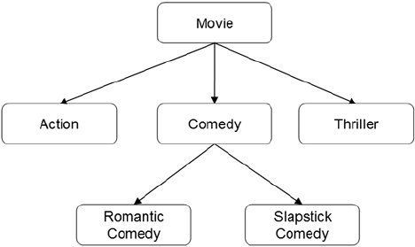
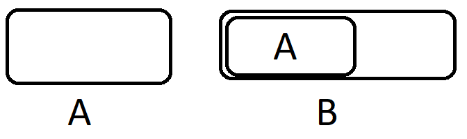
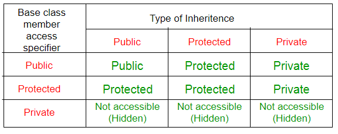

## Наследяване

### Какво е наследяване?
Метод за създаване на нови класове от съществуващи класове (механизъм за повторно използване). <br />
Новият клас съдържа данни и поведение на съществуващия клас. <br />
     
### Видове наследяване:
- **Single(единично):** нов клас се създава от друг единичен клас.
- **Multiple(множествено):** нов клас се създава от два (или повече) други класа.

### Терминология
- Base class(parent class)
  - Класът се разширява или наследява.
- Derived class (child class)
  - Класът се създава от базовия клас
  - Наследява атрибути и методи от базовия клас
- Is-a relationship (circle is a shape) 
- Types:
    - Generalization(обобщение):
        - Kомбиниране на подобни класове в един, по-общ клас, базиран на общи атрибути           
    - Specialization(специализация):        
        - Създаване на нови класове от съществуващи класове, осигуряващи по-специализирани атрибути.        
    - Class Hierarchy(йерархия на класовете):            
        - Организация на отношенията при наследяване.           
<br />
       

    
### Inheritance vs Composition
| Наследяване   | Композиция     |
| :---:   | :---: |
| is-a | has-a |
| функционалността, чрез която един обект придобива характеристиките на един или повече други обекти | Използването на обект вътре в друг обект |
| дефиниран по време на компилиране - Compile time | дефиниран по време на изпълнение - Runtime |
| "разкрива" public & protected данни на базовия клас| вътрешните данни не са разкрити/достъпни, а взаимодействат чрез публичен интерфейс(public interface) |
| Access control/Visibility | Access control/Visibility |

### Пример за наследяване
При създаване на нов клас, който има общи компоненти и поведение с вече дефиниран клас, вместо да дефинира повторно тези компоненти и поведение, можем да го обявим за наследник на вече дефинирания.

```c++
class A {
	//some code
public:
    void f() {
		//some code
	}
	//some code
};

class B : public A {
	//some code
}

int main() {
	B obj;
	obj.f(); // OK!
}
```

При наследяването:
- Наследяват се член-данните и методите на основните класове
- Получава се достъп до **някои** от наследените компоненти на основните класове

В нашия пример класът **В е наследник на класа А.** Обекти от класовете изглеждат така:



След като В е наследник на класа А, то при създаване на обект от тип В се създава обект от тип А, **който е част от обекта** от тип В.

### Видове наследяване
Някои типове наследяване в C++:
 - private (по подразбиране)
 - protected
 - public



Примери:
```c++
class A  {
public:
    int x;
protected:
	int y;
private:
    int z;
};

class B : public A {
    // x is public
    // y is protected
    // z is not accessible from B
};

class C : protected A {
    // x is protected
    // y is protected
    // z is not accessible from C
};

class D : private A { // 'private' is default for classes
    // x is private
    // y is private
    // z is not accessible from D
};
 ```

### Подаване като параметри на функции.
Класове-наследници могат да бъдат подавани като параметри на функции, които приемат обекти от базовия клас. <br />
Може да се използва функционалността само от базовия клас.

```c++
class A {
public:
	int a;
};

class B : public A {
public:
	int b;
};

void f(A& obj) {
	obj.a++;
}

int main() {
	A obj1;
	B obj2;
	
	f(obj1); //OK!
	f(obj2); //OK!
}
 ```

### Конструктури и деструктори при наследяване.

- Конструктори и инициализация на клас:
  - Derived class **наследява** от своя Base class
  - Base class-a **трябва** да бъде инициализиран **преди** да се инициализира Derived class-a
  - Когато се създаде Derived class:
    - Изпълнява се конструктора на Base class-a
    - Изпълнява се конструктора на Derived class-a
- Деструктори:
  - Деструкторите се извикват в обратен ред на конструкторите.
  - Данните да Derived **трябва** да бъдат освободени, **преди** да се извика деструкторът на базовия клас.
  - Всеки деструктор **трябва** да освободи ресурсите, заделени в неговите собствени конструктори.

```c++
Q: How can we control exactly which Base class constructor is used during initialization?
A: We can invoke whichever Base class constructor we wish in the initialization list of the Derived class.
```
Във всеки контструктор на класът-наследник, трябва да се оказва кой конструктор да се извика за базовия клас. <br />
Ако не оказано, ще се извика конструктора по подразбиране.

```c++
class Derived : public Base {
    .
    .
    .
public:
Derived(...) : Base(...) {
		.
		.
		.
	}
}
```
 
```c++
class Base {
private:
	int value;
public:
	Base() : value(0) {
		std::cout << "Base default constructor called\n";
	}

	Base(int x) : value(x) {
		std::cout << "Base (int) constructor called\n";
	}

	~Base() {
		std::cout << "Base destructor called\n";
	}
};

class Derived : public Base {
private:
	int doubledValue;
public:
	Derived() : Base(0), doubledValue(0) {
		std::cout << "Derived default constructor called\n";
	}

	Derived(int x) : Base(x), doubledValue(2*x) {
		std::cout << "Derived (int) constructor called\n";
	}

	~Derived() {
		std::cout << "Derived destructor called\n";
	}
};
```
Деструкторът на наследния клас извиква деструктора на базовия клас.

### Копиране при наследяване
При разписване на конструктора за копиране и оператора за присовяване на клас-наследник, трябва експлицитно да извикваме копиране и за базовия клас.
 ```c++
B::B(const B& other) : A(other) { // (copy constructor of A (base class)
	copyFrom(other);
}

B& B::operator=(const B& other) {
	if (this != &other) {
		A::operator=(other); //operator= of A (base class)
		free();
		copyFrom(other);
	}
	return *this;
}
 ```

- Ако **НЕ** ги дефинирате в Derived класа, компилаторът **ще ги създаде автоматично** и ще извика **версията на базовия клас**.
- Ако ги дефинираме в Derived класа, **трябва изрично** да се извикат базовите(invoke the Base class definition **explicitly**)

### Move semantics

```c++
class MyString {
private:
	char* str;
public:
	//... constructors
	MyString(MyString&& rhs) : str(rhs.str) {
		rhs.str = nullptr;
	}

	MyString& operator=(MyString&& rhs) {
		if (this != &rhs) { 
		    delete[] this->str;  //deallocate storage for this->str since we are overwriting it
		    str = rhs.str;		 //steal the pointer from the rhs object and assign it to this->str
		    rhs.str = nullptr;   //null out the rhs pointer
        	}
		return *this;		 //return the current object by reference to allow chain assignment
	}
};

class Text : public MyString {
private:
	char* biggerStr;
public:
	//consturctors
	Text(Text&& rhs) : MyString(std::move(rhs)), biggerStr(rhs.biggerStr) {
		rhs.biggerStr = nullptr;
	}
	
	Text& operator=(Text&& rhs) {
		if (this != &rhs) {
			MyString::operator=(std::move(rhs));
			delete[] biggerStr;
			biggerStr = rhs.biggerStr;
			rhs.biggerStr = nullptr;
		}
		return *this;
	}
};
```


 **Задача 1:**
Реализирайте класов бар, в който се продават нормални напитки и алкохолни напитки. Трябва да имате функции за зареждане на напитки от бара и взимане на напитка от бара. **Капацитетът** на различните артикули в бара е 100. 

При зареждането се посочва и броят на артикулите, които се зареждат. Ако не се каже брой - зарежда се 1 артикул.

При взимането на напитка от бара: Избира се тип (нормална или алкохолна) и се връща тази, която е най-скоро добавена. 
Във всеки момент трябва да могат да се взимат статистика за бара - брой продадени артикули oт всеки тип и сумарно продадени мл.

**Напитката** има име (низ с произволна дължина, само от латински символи, в който първият символ е главен), количество (в мл [200, 1000]), а **алкохолната напитка** има *име (низ с произволна дължина, само от латински символи, в който първият символ е главен),  количество (в мл [200, 1000]) и процент алкохол [5, 98]*.

Примерен интерфейс:
 ```c++

int main()
{
	Bar b;

	b.addDrink("Coke", 330, 2); //2x Coca cola 330 ml

	b.addDrink("Fanta", 500);   //1x Fanta 500 ml

	b.addAlocoholDrink("Zagorka", 500, 5); //1x Zagorka, 5% alc,  500 ml

	b.getAcloholDrink(); // Zagorka 
	
	b.getDrink() // Fanta
	b.getDrink() // Coke
	b.getDrink() // Coke
	
	b.getAlocholDrinksSold(); // 1
	b.getDrinksMlSold(); // 1660

}
 ```
 **Задача 2:**
 Имплементирайте клас за множество от естествени числа по критерии. Класът трябва да приема в конструктора цяло число - максималното число, което може да се запази в множеството и две булеви функции: за включване на число (тези, които да са елементи на множеството) и изключване на число(тези, които първата функция връща истина, но искаме да не ги поставим в множеството). Едно цяло число е в множеството, когато **функията за включване връща истина** за него и **ф-ята на изключване връща лъжа** за него. Трябва да имате функции за проверка дали число е в множеството (за константно време), за връщане на броя на елементите и за принтиране на множеството.
 
Примерен интерфейс:
 ```c++

int main()
{
	SetByCriteria s(10, isPrime, isOdd);

	s.print(); // {2}
}
 ```

Имплементирайте и клас за **множество по стринг**. Множество, което в конструктора приема цяло число - максималното число, което може да се запази в множеството и **символен низ - числата, които да се запазят, разделени с интервал**. Трябва да имате функция за промяна на стринга, както и за промяна на символ по индекс. Трябва да имате и функции за проверка дали число е в множеството (за константно време), за връщане на броя на елементите и за принтиране на множеството.

 ```c++
int main()
{
	SetByString s(300, "1 2 3");

	s.print(); // {1, 2, 3}
	
	s.setAt(1, '1');
	
	s.print(); // {3, 112}
}
 ```
