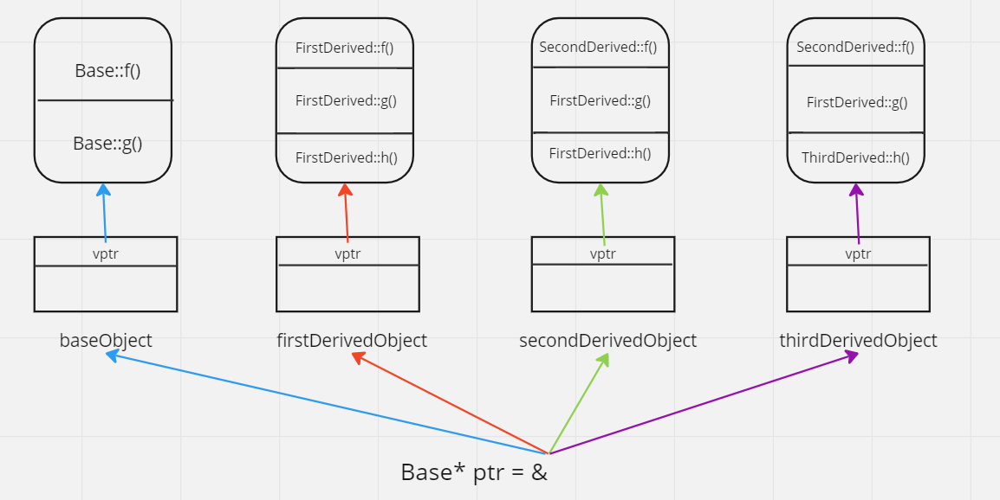
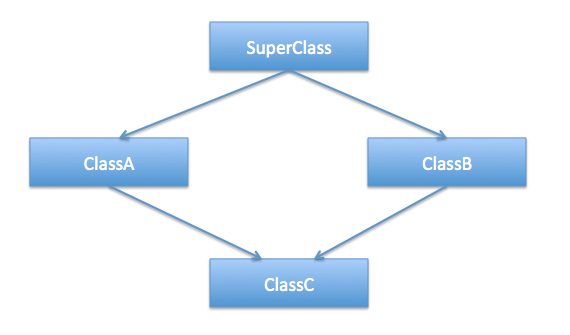

## Статично и динамично свързване. Virtual functions(Виртуални функции)

```c++
#include <iostream>

class Base {
public: 
  void f() const  {
    std::cout << "A::f()\n";
  }
};

class Derived : public Base {
public:
  void f() const {
    std::cout << "B::f()\n";
  }
};

void func(const Base& obj) {
    obj.f();
}	

int main() {
  Derived* bPtr = new Derived();
  Base* aPtr = bPtr;

  //Early binding - Compile time
  func(*aPtr); // Base::f()
  func(*bPtr); // Base::f()
}
```

- **Статично** свързване(Static binding/Early binding) - изборът на функцията, която трябва да се изпълни става **по време на компилация(Compile time)**
- **Динамично** свързване(Dynamic binding/Late binding) – изборът на функцията, която трябва да се изпълни става **по време на изпълнение на програмата(Run time)**.

```c++
#include <iostream>

class Base {
public:
  virtual void f() const {
    std::cout << "A::f()\n";
  }
};

class Derived : public Base {
public:
  void f() const override {
    std::cout << "B::f()\n";
  }
};

int main() {
  Base* ptrs[2];
  ptrs[0] = new Base(); //Base pointer to Base class object
  ptrs[1] = new Derived(); //Base pointer to Derived class object

  //Dynamic/Late Binding - Runtime
  ptrs[0]->f(); // Base::f()
  ptrs[1]->f(); // Derived::f()
}
```

**Виртуална функция** - член-функция, която е декларирана в основен клас(Base class) и е предефинирана от производен клас(Derived class). <br />
Гарантират, че правилната функция ще се извика за даден обект, независимо от типа reference/pointer(типа препратка), <br />
използван за извикване на функцията. Те се използват главно за постигане на Runtime polymorphism. <br />

### Правила за виртуални функции
  - **не могат** да бъдат static.
  - Прототипът на виртуалните функции трябва да бъде един и същ както в базовия, така и в производния клас.
  - Винаги се дефинират в базовия клас, като се предефинират в производния. Не е задължително производния клас да заменя или предефинира виртуалната функция, в такъв случай се използва версията на базовия клас.
  - Достъпът до виртуалните функции трябва да се осъществява използвайки reference/pointer към базовия клас, за да се осъществи Runtime polymorphism.
  - **Класът може да има виртуален деструктор, но не може да има виртуален конструктор.**

### Specifiers - override & final
- override указва, че дадена функция презаписва функция от базовия клас. Ако в базовия клас няма такава функция, то кодът няма да се компилира.
- final указва, че дадена функция не може да се презависва надолу по йерархията или че даден клас не може да се наследява.

### Virtual pointer(vPtr) | Virtual table(vTable)

Нека да разгледаме следната йерархия:

```c++
#include <iostream>

class Base {
public:
  virtual void f() const {
    std::cout << "Base::f()\n";
  }

  virtual void g() const {
    std::cout << "Base::g()\n";
  }

  void nonVirtual() const {
    std::cout << "Base::nonVirtual()\n";
  }
};

class FirstDerived : public Base {
public:
  void f() const override {
    std::cout << "FirstDerived::f()\n";
  }

  void g() const override {
    std::cout << "FirstDerived::g()\n";
  }

  virtual void h() const {
    std::cout << "FirstDerived::h()\n";
  }
};

class SecondDrived : public FirstDerived {
public:
  void f()const override {
    std::cout << "SecondDrived::f()\n";
  }
};

class ThirdDerived : public SecondDrived {
public:
    void h() const override {
        std::cout << "ThirdDerived::h()\n";
    }
};
```

и да създадем обекти от всеки един от тях:

```c++
int main() {
   Base baseObject;
   FirstDerived firstDerivedOject;
   SecondDerived secondDerivedObject;
   ThirdDerived thirdDerivedObject;

   Base* p = nullptr;

   p = &baseObject;
   p->f(); //static call to Base::f()
   p->g(); //static call to Base::gl()
   p->nonVirtual();  //static call to Base::nonVirtual()
   
   std::cout << "----------" << std::endl;

   p = &firstDerivedOject;
   p->f(); // Dynamic binding - FirstDerived::f()
   p->g(); // Dynamic binding - FirstDerived::g()

   std::cout << "----------" << std::endl;

   p = &secondDerivedObject;
   p->f(); // Dynamic binding - SecondDerived::f()
   p->g(); // Dynamic binding - SecondDerived::g()

   std::cout << "----------" << std::endl;

   p = &thirdDerivedObject;
   p->f(); // Dynamic binding - ThirdDerived::f()
   p->g(); // Dynamic binding - ThirdDerived::g()
}
```

На p можем да му присвоим адресите на кой да е от тези обекти и за всеки един от тях бихме могли да извикаме функциите f() и g(), като компилаторът във всеки един случай трябва да може да определи коя е правилната такава, която трябва да се извика. <br />
Във връзка с горното парче код, грубо казано компилаторът прави следното - обхожда (тръгвайки от базовия, продължа класовете, които участват в йерархията и за всеки един от тях, в зависимост от това - в кой от тях коя виртуална функция се предефинира(или декларира, т.к. във всеки един момент може да се добави нова такава по веригата) и за всеки един от тях създава таблица. <br />
Таблиците държат адресите на "правилните" функции, които трябва да се извикат в последствие. <br />



**Поясненине:**
- спазва се "индексът" на всяка една функция в хода на веригата, тоест, функцията f() седи все на позиция 0 в таблиците, докато g() - на позиция 1 и т.н.
- В момента, в който създадем обект от тип Base, той може да си има някакви променливи, но в момента, в който добавим и виртуална функция към него, скрито се добавя и допълнителен параметър - указател към съответстващата му виртуална таблица, като къде точно е разположен той - в началото, средата или края вече не е еднозначно определено.
- Aко имаме един Base ptr, който където и да сочи, може да използваме следната логика:
  - взимаме пойнтера;
  - намираме към какво сочи;
  - намираме виртуалния пойнтер;
  - намираме таблицата, към която той сочи;
  - по посочения от таблицата адрес - намираме функцията;

При всяко едно от горните извиквания се процедира така:

```c++
  p->f(); 

  /*
   * 1. p сочи към Base
   * 2. f е виртуална функция
   * 3. На базата на p намираме обекта
   * 4. Намираме таблицата
   * 5. Знаем индекса в таблицата
   * 6. Извикваме съответната функция
   * 7. В качеството на this подаваме съответния обект
   */

```

## Полиморфизъм
 
Едни и същи действия се реализират по различен начин в зависимост от обектите, върху които се прилагат.
- Действията се наричат полиморфни;
- Реализира се чрез виртуални функции;
- Класовете, върху които ще се прилага, трябва да имат общ родител или прародител, т.е. да са наследници на един и същ клас.
- В класа се дефинира виртуален метод, съответстващ на полиморфното действие.
- Всеки клас предефинира или не виртуалния метод.
- "Активирането" става чрез указател към базов клас, на който може да се присвоят адресите на обекти, на които и да е от базовите класове от йерархията

**Важно!**
При полиморфна йерархия ще изтриваме обектите чрез указатели от базовия клас. <br />
За да се извикват правилните деструкори задължително деструкторът на базовият клас трябва е деклариран като виртуален! <br />

Да разгледаме случай, в който деструктора при базовия клас не е дефиниран като виртуален:

```c++
class Base {
public:
  Base() {
     std::cout << "Base::Base()\n";
  }

	~Base() {
     std::cout << "Base::~Base()\n";
  }
};

class Derived : public Base {
public:	
  Derived {
    std::cout << "Derived::Derived()\n";
  }

  ~Derived() {
    std::cout << "Derived::~Derived()\n";
  }
};

int main() {
	Base* ptr = new Derived();
	delete ptr; //invokes the destructor of Base only, since ~Base() is not virtual
}
```

при компилация получаваме:

```
Base::Base()
Derived::Derived()
Base::~Base()
```

т.е. се извиква единствено деструктора на базовия клас, но **не и този на наследника**. <br />
Декларираме деструктора като virtual и получаваме:

```c++
class Base {
public:
  Base() {
     std::cout << "Base::Base()\n";
  }

	virtual ~Base() {
     std::cout << "Base::~Base()\n";
  }
};

class Derived : public Base {
public:	
  Derived {
    std::cout << "Derived::Derived()\n";
  }

  ~Derived() {
    std::cout << "Derived::~Derived()\n";
  }
};

int main() {
	Base* ptr = new Derived();
	delete ptr; 
}
```

```
Base::Base()
Derived::Derived()
Derived::~Derived()
Base::~Base()
```
т.е. вече правилно се извикват съответните деструктори!

```c++
#include <iostream>

class Animal {
public:
	virtual void sayHello() const {
		std::cout << "Hello, I am a random animal\n";
	}

	virtual ~Animal() = default; //virtual destructor
};

class Dog : public Animal {
public:
	void sayHello() const override {
	  std::cout << "Hello, I am a dog!\n";
	}
};

class Cat : public Animal {
public:
	void sayHello() const override {
	  std::cout << "Hello, I am a cat!\n";
  }
};

class Mouse : public Animal {};

int main() {
	Animal** animals = new Animal*[3];

	animals[0] = new Dog();
	animals[1] = new Cat();
	animals[2] = new Mouse();


	//from Base-class pointer
	animals[0]->sayHello(); // Hello, I am a dog!
	animals[1]->sayHello(); // Hello, I am a cat!
	animals[2]->sayHello(); // Hello, I am a random animal!

  for(size_t i = 0; i < 3; ++i) delete animals[i];
	delete[] animals;
}
```

## Абстрактен клас

- Чисто виртуална функция (pure virtual function) - виртуална функция без тяло.
- Клас е абстрактен, ако в него има поне една чисто виртуална функция.

Тогава класът е предназначен единствено за наследяване и няма да може да създаваме обекти от него. Така във всеки наследник ще трябва да се разпише имплементация на функцията. Ако някой наследник няма собствена имплементация, то и той става абстрактен клас.

```c++
#include<iostream>

class Animal {
public:
  virtual void sayHello() const = 0;
  
	virtual ~Animal() = default; 
};

class Dog : public Animal {
public:
	void sayHello() const override {
	  std::cout << "Hello, I am a dog!\n";
	}
};

class Cat : public Animal {
public:
	void sayHello() const override {
		std::cout << "Hello, I am a cat!\n";
	}
};

class Mouse : public Animal {
public:
	void sayHello() const override {
		std::cout << "Hello, I am a mouse!\n";
	}
};

struct PrehistoricAnimal : public Animal
{};

int main() {
	// Animal* pa1 = new Animal(); No! Animal is an abstract class!
	// Animal* pa2 = new PrehistoricAnimal(); No! PrehistoricAnimal is also an abstract class!

	Animal** animals = new Animal*[3];

	animals[0] = new Dog();
	animals[1] = new Cat();
	animals[2] = new Mouse();


	//from base-class pointer
	animals[0]->sayHello(); // Hello, I am a dog!
	animals[1]->sayHello(); // Hello, I am a cat!
	animals[2]->sayHello(); // Hello, I am a mouse!

	for(size_t i = 0; i < 3; ++i) delete animals[i];
	delete[] animals;
}
```

### Pure virtual Destructor

```c++
// Initilization of base class
class Base {
public:
    virtual ~Base() = 0; // Pure virtual destructor
};

// Initilization of derived class
class Derived : public Base {
public:
  ~Derived() {
      std::cout << "~Derived() is executed\n";
  }
};

int main() {
    // base class pointer which is
    // allocating fresh storage
    // for Derived function object's
    Base* b = new Derived();
    delete b;
}
```

```
Compile error!
```

Pure virtual destructor трябва изрично да бъде дефиниран.(explicitly defined)

```c++
// Initilization of base class
class Base {
public:
    virtual ~Base() = 0; // Pure virtual destructor
};

Base::~Base() { // Explicit destructor call
  std::cout << "Pure virtual destructor is called\n";
}

// Initilzation of derived class
class Derived : public Base {
public:
  ~Derived() {
    std::cout << "~Derived() is executed\n";
  }
};

int main() {
    // Calling of derived member function
    Base* b = new Derived();
    delete b;
}
```

### Interface vs Abstract Classes:

Интерфейсът няма реализация на нито един от своите методи.Tой може да се разглежда като колекция от декларации на методи. <br />
В C++ интерфейсът може да бъде симулиран, като всички методи се правят като чисто виртуални. <br />

Допълнително информация: В Java има отделна ключова дума за интерфейс.
- keyword interface за интерфейс
- keyword abstract за aбстракция (function can be made pure virtual or abstract with keyword abstract)

## Diamond problem



```c++
//Indicate problem

#include <iostream>

class SuperClass {
public:
  SuperClass() {
    std::cout << "SuperClass default constructor is called\n";
  }
};

class A : public SuperClass {
public:
  A() {
    std::cout << "A default constructor is called\n";
  }
};

class B : public SuperClass {
public:
  B(){
      std::cout << "B default constructor is called\n";
  }
};

class C : public A, public B {
public:
  C() {
    std::cout << "C default constructor is called\n";
  }
};

int main() {
    C obj;
}
```

**Output:**

```
SuperClass default constructor is called
A default constructor is called
SuperClass default constructor is called //<------------
B default constructor is called
C default constructor is called
```

Конструктора на SuperClass бива извикан 2 пъти, а ако имахме и деструктор - той също щеше да бъде извикан 2 пъти. <br />
Тоест, обектът obj има 2 копия на всички данни на базовия клас SuperClass, което предизвиква двусмислия/неяснотии(ambiguous behaviour) <br />

```c++
#include <iostream>

class SuperClass {
public:
  SuperClass() {
    std::cout << "SuperClass default constructor is called\n";
  }
};

class A : virtual public SuperClass {
public:
  A() {
    std::cout << "A default constructor is called\n";
  }
};

class B : virtual public SuperClass {
public:
  B(){
    std::cout << "B default constructor is called\n";
  }
};

class C : public A, public B {
public:
    C() {
        std::cout << "C default constructor is called\n";
    }
};

int main() {
    C obj;
}
```

**Output:**

```
SuperClass default constructor is called
A default constructor is called
B default constructor is called
C default constructor is called
```

Solution - virtual. <br />
Класовете А и В трябва да бъдат виртуални базови класове(virtual inheritance), за да избегнем 2-те копия на SuperClass. <br />

**Важно:** Когато използваме keyword: virtual, конструкторът по подразбиране на прародителя се извиква по подразбиране, дори ако родителските класове извикват изрично конструктор с параметри. <br />
