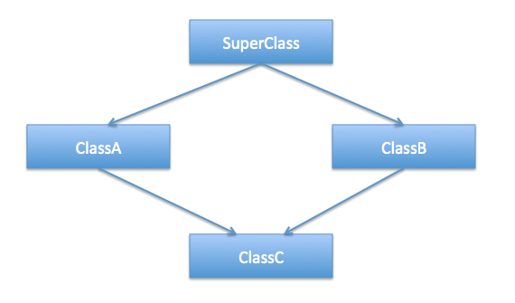

# Шаблони. Множествено наследяване. Виртуално наследяване. Виртуални таблици при множествено и виртуално наследяване. Диамантен проблем.

## Cpp Insights - See your source code with the eyes of a compiler.
Линк към Cpp Insights [тук](https://cppinsights.io/)

C++ Insights is a Clang-based tool that does a source-to-source transformation. The goal of C++ Insights is to make things visible that normally and intentionally happen behind the scenes. It's about the magic the compiler does for us to make things work.

С този tool може сами да стигнете до извода защо на домашно 2 не успяхте да присвоите lambda function, която има capture clause. Досега стигахме по пътя на логиката, все пак lambda с capture clause, значи функцията да има някакъв свой state(набор от променливи), това не може да се държи в просто един function pointer.

Пробвайте да компилирате следния код:
``` c++
#include <cstdio>
#include <iostream>

int main() {
  [](){ std::cout << 1; };
  
  int y;
  [y](){std::cout << y;};
}
```

Ще получите резултат подобен на:
```c++
#include <cstdio>
#include <iostream>

int main()
{
  class __lambda_5_3
  {
    public: 
    inline /*constexpr */ void operator()() const
    {
      std::cout.operator<<(1);
    }
    
    using retType_5_3 = void (*)();
    inline constexpr operator retType_5_3 () const noexcept
    {
      return __invoke;
    };
    
    private: 
    static inline /*constexpr */ void __invoke()
    {
      __lambda_5_3{}.operator()();
    }
    
    
  } __lambda_5_3{};
  
  int y;
    
  class __lambda_8_3
  {
    public: 
    inline /*constexpr */ void operator()() const
    {
      std::cout.operator<<(y);
    }
    
    private: 
    int y;
    
    public:
    __lambda_8_3(int & _y)
    : y{_y}
    {}
    
  } __lambda_8_3{y};
  
  return 0;
}

```

Основната разлика е, че първата lambda-а има допълнителна член функция ```operator retType_5_3```, която се използва за cast-ване към ```refType_5_3```(подобно на operator bool), където ```using retType_5_3 = void (*)();```. Тоест това е кастване към function pointer.

## Шаблони
Ресурсите за шаблони се намират в папката [Sem. 12](../Sem.%2012/)

## Диамантен проблем



```c++
//Indicate problem

#include <iostream>

class SuperClass {
public:
    SuperClass() {
        std::cout << "SuperClass default constructor is called\n";
    }
};

class A : public SuperClass {
public:
    A() {
        std::cout << "A default constructor is called\n";
    }
};

class B : public SuperClass {
public:
    B() {
        std::cout << "B default constructor is called\n";
    }
};

class C : public A, public B {
public:
    C() {
        std::cout << "C default constructor is called\n";
    }
};

int main() {
    C obj;
}
```

**Output:**

```
SuperClass default constructor is called
A default constructor is called
SuperClass default constructor is called //<------------
B default constructor is called
C default constructor is called
```

Конструктора на SuperClass бива извикан 2 пъти, а ако имахме и деструктор - той също щеше да бъде извикан 2 пъти. <br />
Тоест, обектът obj има 2 копия на всички данни на базовия клас SuperClass, което предизвиква двусмислия/неяснотии(ambiguous behaviour) <br />

## Виртуално наследяване
Решението на горният проблем е използването на виртуално наследяване. <br />
Класовете А и В трябва да наследят виртуално SuperClass, за да избегнем 2-те копия на SuperClass.

Когато използваме keyword: virtual при наследяване, конструкторът по подразбиране на прародителя се извиква по подразбиране, дори ако родителските класове извикват изрично конструктор с параметри. Тоест всеки наследник на клас, който наследява друг като virtual, трябва да избере кой конструктор се вика на прародителя(виртуално наследения клас). В случая C, трябва експлицитно да каже кой конструктор на SuperClass да се извика. <br />


```c++
#include <iostream>

class SuperClass {
public:
    SuperClass() {
        std::cout << "SuperClass default constructor is called\n";
    }
};

class A : virtual public SuperClass {
public:
    A() {
        std::cout << "A default constructor is called\n";
    }
};

class B : virtual public SuperClass {
public:
    B() {
        std::cout << "B default constructor is called\n";
    }
};

class C : public A, public B {
public:
    C() {
        std::cout << "C default constructor is called\n";
    }
};

int main() {
    C obj;
}
```

**Output:**

```
SuperClass default constructor is called
A default constructor is called
B default constructor is called
C default constructor is called
```
